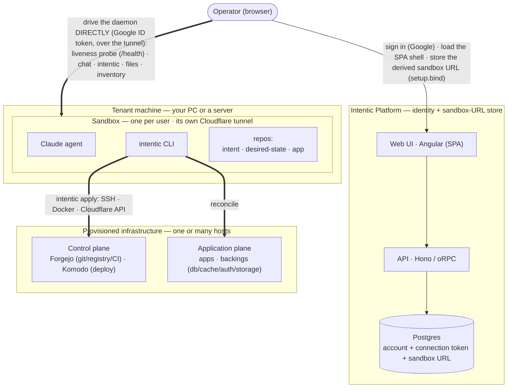
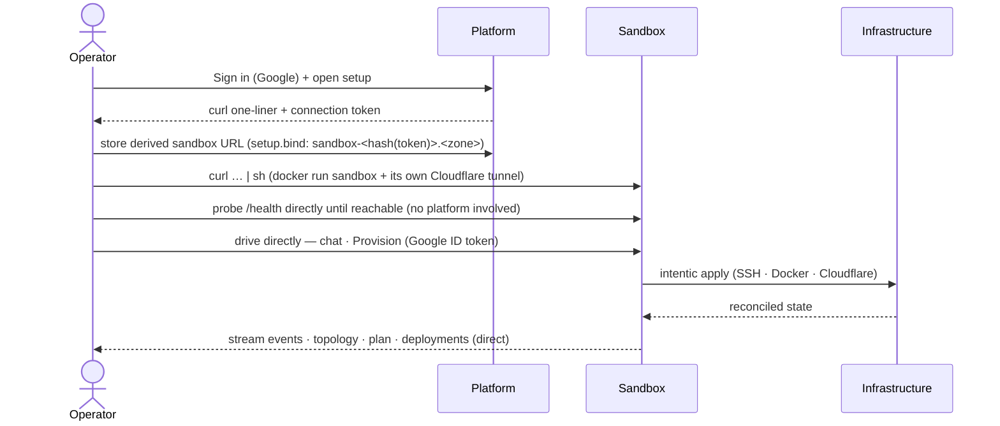

# Architecture

intentic is **intent-driven deployment**: you declare *what you have* (the host apps run on, the Cloudflare
they're exposed through) and *what you want* (apps); the system computes every valid way to satisfy that,
picks one, and reconciles infrastructure until reality matches.

## System topology & lifecycle

The engine flow below is what runs *inside* one `intentic apply`. At runtime the whole product
is three tiers: a thin **Platform** (identity + sandbox-URL store), a per-user **Sandbox** (where the
agent and the CLI actually run, reached by the browser directly), and the **infrastructure** the
sandbox provisions.



- **Platform (identity + sandbox-URL store)** — Angular SPA + Hono/oRPC API. Persists only the
  operator's account, one secret-free per-user connection token, and the sandbox's public `daemonUrl`
  (which the **browser** derives and writes); it never probes the sandbox or tracks liveness, owns no
  infrastructure, no secrets, and sits **off the command path**.
- **Sandbox** — one per user, run **unprivileged** (its container holds no Docker socket). Runs the
  Claude agent and the `intentic` CLI over the three repos (`intent` = `deploy.config.ts`, the IaC;
  `desired-state` = resolved artifact + status; `app` = the application code), and exposes its daemon
  over its **own Cloudflare tunnel**. SSH keys, Cloudflare and Claude tokens ride straight into it and
  never reach the platform.
- **Trust root = browser Google Sign-In** — the browser drives the daemon directly with a Google ID
  token; the daemon verifies it against Google's JWKS and binds its owner. The platform never holds or
  forges that token, so a platform breach can read the stored URL but **cannot drive any sandbox** — the
  hub's blast radius is bounded to identity + the sandbox URL.

The lifecycle, from first sign-in to a reconciled deployment the operator can watch:



**One image, two ways to start.** The sandbox `connect.sh` runs on your PC and the one the
`i.want.workspace` provider deploys onto a remote host (over SSH) are the *same image*. On your PC,
`connect.sh` gives it its own Cloudflare tunnel — `sandbox-<id>.<zone>` for the daemon (browser-direct)
plus `*.preview.<zone>` for the app preview. On a server it is just another service on that host's shared
tunnel, exposing only `*.preview.<zone>` (the daemon stays host-internal — the server workspace is
preview-only; `connect.sh` is the browser-direct path). The infrastructure it *provisions*, either way,
builds Cloudflare tunnels on its target hosts (see below) — which is how the system fans out to "workers
on many machines."

### Cloudflare is the reachability fabric (required)

Cloudflare is not a user-facing convenience — it is the system's **reachability fabric**, and it is
**required**. The operator never needs to open `git.<zone>` / `deploy.<zone>`; the **browser reads the
control plane through the sandbox daemon directly** (over the sandbox's tunnel). How each piece is reached
is asymmetric:

| Reached over | Who / what |
| --- | --- |
| **SSH** (internal `:3000`) | Forgejo — the engine runs its git/CI API calls *through the host's SSH session*, so no tunnel is needed for it. |
| **Cloudflare tunnel** (public `*.<zone>`) | Komodo (`deploy.<zone>`), the container registry (`git.<zone>`), and every worker host's Komodo Periphery dialing Core — all cross-host. |

Why a tunnel, rather than "just use SSH and make Cloudflare optional":

- **Outbound-only, NAT-traversing.** `cloudflared` dials out, so it works behind NAT/firewalls with no
  inbound ports — the same bet the sandbox already makes to expose its daemon.
- **Cross-host coordination needs stable, routable names.** Worker→Core registration and image pulls are
  host-to-host; SSH from the sandbox only reaches *sandbox→service*, so an SSH-only design would still have
  to add an overlay network to serve them.
- **The registry forces a global name anyway.** Image refs (`git.<zone>/owner/app:tag`) must resolve
  identically from every host that pulls — that alone mandates a stable domain.
- **One uniform primitive** (`<name>.<zone>`, TLS'd, reachable from anywhere) keeps the model trivially
  reason-about-able; a second internal/SSH mode would mean two reachability models and a combinatorial matrix.

This is enforced in code, not just convention: the SDK types require `expose: Cloudflare`, and both
`resolveNeeds` ([needs.ts](_libs/need-resolver/src/needs.ts)) and `emit`
([emit.ts](_libs/state-resolver/src/emit.ts)) throw when it is missing — there is no alternative ingress.
The Cloudflare API token is supplied at **connect** time (it rides `connect.sh` into the sandbox) and consumed
at **provision** time by `intentic apply`. It never reaches the platform except for one request-scoped call at
setup — the platform lists the token's zones so the user can pick which one the sandbox tunnel uses (the browser
can't call Cloudflare directly), then drops the token: never persisted, never logged.

## The intent-driven flow

```
Intent ──► NeedResolver ──► Needs ──► StateResolver ──► desired state ──► Execute ──► (reads true)
```

1. **Intent** — a declaration authored with the SDK: `i.have.host(...)` / `i.have.cloudflare(...)` (the
   inventory you have) and `i.want.app(...)` (what you want), each app wired to its host/Cloudflare via
   `on` / `expose`. Captured as a serializable `IntentSet`. ([_libs/sdk/src/stack.ts](_libs/sdk/src/stack.ts))
2. **Need resolver** — derives the abstract capabilities the intent requires: `source-control`,
   `docker-registry`, `infra-control` (control plane), `deployment-target`, `domain` (application plane).
   (`resolveNeeds` in [_libs/need-resolver/src/needs.ts](_libs/need-resolver/src/needs.ts))
3. **State resolver** — assigns each need its catalog option and compiles the emitted nodes into one
   **desired state** (a `DesiredStateGraph`). The catalog maps capabilities to the concrete things that
   satisfy them; one option may cover several (Forgejo provides both source-control and docker-registry).
   The intent fully determines the result — there is no choice to make, so the catalog offers exactly one
   option per capability. (`resolveState` in [_libs/state-resolver/src/state.ts](_libs/state-resolver/src/state.ts),
   over `defaultCatalog` in [catalog.ts](_libs/state-resolver/src/catalog.ts) and the nodes emitted by
   [emit.ts](_libs/state-resolver/src/emit.ts))
4. **Execute** — apply the desired state and re-read it, looping until a plan reads all-noop ("state reads
   true"). (`reconcile` in [_libs/engine/src/reconcile-loop.ts](_libs/engine/src/reconcile-loop.ts), over
   `apply`/`plan` and the Provider SPI)

A `DesiredStateGraph` is the central data structure: a serializable, dependency-ordered set of resource
nodes with refs, secrets, and readiness gates. ([_libs/graph/src/types.ts](_libs/graph/src/types.ts))

## Output contract (driving the CLI as a service)

The engine separates two seams on `EngineConfig`: `log` carries providers' free-form strings, and
`onEvent` emits structured `EngineEvent`s for lifecycle progress — `node` (apply/plan, start/done with
the action), `readiness`, `iteration`, `prune`, and `orphan`
([types.ts](_libs/engine/src/types.ts)). The CLI selects a renderer from `INTENTIC_OUTPUT`
(`text` | `json` | `ndjson`) in [output.ts](_apps/cli/src/output.ts): `text` is the human default
(unchanged), `json` serializes the command's returned outcome once, and `ndjson` streams each event as
a line then a terminal `result`. The final result is built from the engine's return values
(`PlanOutcome`/`ConvergeResult`/`PruneOutcome` and `collectAccess`), never from events — so a control
plane gets both live progress and a parseable summary, and embedders consume `EngineEvent` directly.

## Control plane vs application plane

Every need carries a `plane` — its role, independent of where it runs ([needs.ts](_libs/need-resolver/src/needs.ts)):

- **Control plane** — the deploy machinery: `source-control` + `docker-registry` (Forgejo) and
  `infra-control` (Komodo) — git/CI plus the deploy orchestrator. The local `intent` repo
  (`deploy.config.ts`) and `desired-state` repo (the artifact + execution status) drive it: `intentic
  resolve` runs the flow above and writes the artifact, `intentic apply` executes it. A remote, PR-managed
  control plane (a standalone Forgejo watching the intent repo) is a planned later evolution of this same
  flow. ([_apps/cli/src/resolve.ts](_apps/cli/src/resolve.ts), [artifact.ts](_apps/cli/src/artifact.ts),
  [app.ts](_apps/cli/src/app.ts))
- **Application plane** — what actually serves an app: its `deployment-target` (the app's runtime on the
  host) and its `domain` (the Cloudflare tunnel + DNS routes). Both are *derived from* `i.want.app` and
  emitted alongside the control-plane stack. ([_libs/state-resolver/src/platform.ts](_libs/state-resolver/src/platform.ts),
  [_libs/providers/](_libs/providers/src/))

The whole per-host support stack is self-contained: its control-plane Forgejo is just another reconciled
node, so `apply` needs no pre-existing control plane. A future remote control plane would reuse the same
`forgejo` provider — a different node instance, not a different implementation.

## Packages

Dependency direction (one-way):

```
graph ──► resources ──► engine ──► providers
   │           └──────► state-resolver ──► sdk
   ├──► need-resolver ──► state-resolver
   └──► (cli ◄── need-resolver, state-resolver, engine, providers)
```

| Package | Tier | Role |
| --- | --- | --- |
| [`@intentic/graph`](_libs/graph) | lib | Product-agnostic IR: refs, secrets, readiness, `DesiredStateGraph`, and the compiler. |
| [`@intentic/resources`](_libs/resources) | lib | The closed resource vocabulary shared by the state resolver, engine, and providers: `ResourceType`, `ResolvedNode`, and `OUTPUTS`. |
| [`@intentic/need-resolver`](_libs/need-resolver) | lib | The need resolver: intent → needs. Owns the authored intent/input shapes, `resolveNeeds`, and `Capability`/`Need`/`Plane`. |
| [`@intentic/state-resolver`](_libs/state-resolver) | lib | The state resolver: needs → desired state, over the option catalog. `resolveState`, the catalog, `emit`, and the platform/app/route/id derivation. |
| [`@intentic/sdk`](_libs/sdk) | lib | Authoring surface (`i.have.host` / `i.have.cloudflare` + `i.want.app`); `defineIntent` (→ `IntentSet`) and `defineStack` (one graph). |
| [`@intentic/engine`](_libs/engine) | lib | Stateless reconcile engine: `plan`/`apply`, the Provider SPI, and the `reconcile` loop. |
| [`@intentic/providers`](_libs/providers) | lib | Real Provider SPI impls over SSH/Docker, Cloudflare, Forgejo, Komodo. |
| [`@intentic/cli`](_apps/cli) | **app** | The runnable product: `init` local repos, `resolve` intent → artifact, `apply` it. CLI `bin: intentic`. |
| [`@intentic/sandbox`](_apps/sandbox) | **app** (image) | The per-project AI-agent dev workspace daemon (the Claude agent on the repos + watch-mode preview), reached by the browser directly over its own Cloudflare tunnel. |

The libs + the CLI publish to npm; **`sandbox` ships as a Docker image** to the repo's GHCR
(`ghcr.io/radarsu/intentic/sandbox`, linked to the repo via the image's `org.opencontainers.image.source`
label) — published by [scripts/publish-images.sh](scripts/publish-images.sh) continuously on push to main
(`latest` + commit SHA) and version-tagged on release, and recorded in
[`images.ts`](_libs/state-resolver/src/images.ts) like every other deployed image. The GHCR package is
public so tenant hosts pull it unauthenticated; both `connect.sh` (your PC) and the `workspace` provider
(a server) run this image directly.

## The intent contract

A local `deploy.config.ts` (see [/examples/deploy.config.ts](examples/deploy.config.ts)) must
`export const intent = defineIntent(...)`; `resolve` derives the desired state from it
([resolve.ts](_apps/cli/src/resolve.ts)). `defineStack(...)` is the one-shot,
single-graph form used when a single deterministic graph is wanted directly.

## Conventions (so the layout is predictable)

- **One concept per file**, named for the concept (`reconcile-loop.ts`, `resolve.ts`,
  `forgejo-api.ts`). Tests are **co-located** next to their source.
- **Test naming:** `*.test.ts` = unit; `*.engine.test.ts` = integration driven through the real engine;
  `*.e2e.test.ts` = gated real run (set `INTENTIC_E2E=1`; excluded from CI).
- **Tiers:** `_libs/` = libraries, `_apps/` = runnable products, `_tools/` = shared config. The
  pnpm-workspace glob is `_*/*`.
- **Imports:** import from the true source (no re-exports/aliases). The `@intentic/src` package export
  condition resolves workspace imports straight to `src/`, so agents can edit across packages without
  building.
- The compiled shape of the example/fixture is pinned by
  [_libs/sdk/src/deploy.config.test.ts](_libs/sdk/src/deploy.config.test.ts) against
  [_libs/sdk/src/__fixtures__/deploy.graph.ts](_libs/sdk/src/__fixtures__/deploy.graph.ts).

See [CLAUDE.md](CLAUDE.md) for the code-style rules every change must follow.

## Local end-to-end testing

`createProviders()` ([_libs/providers/src/providers.ts](_libs/providers/src/providers.ts)) assembles the
full `ResourceType → Provider` map — the single seam between a compiled graph and execution. Passing
fakes drives the whole suite in-memory ([suite.engine.test.ts](_libs/providers/src/suite.engine.test.ts));
passing nothing uses the real SSH/Cloudflare/Forgejo/Komodo implementations.

[cli.e2e.test.ts](_apps/cli/src/cli.e2e.test.ts) is a **manual, real** run that drives the actual CLI
exactly as an operator would. It boots a Docker-in-Docker "host"
([test/host/Dockerfile](test/host/Dockerfile)) via `testcontainers`, scaffolds with `init`, authors a
`deploy.config.ts` pointed at the host's mapped SSH port (with a per-run generated key), fills
`desired-state/.env`, then runs `resolve` + `apply`. Phase 1 stands up the platform (Forgejo + its Actions
runner + Komodo + the workspace sandbox) and exposes `git.<zone>`/`deploy.<zone>` through a **real
Cloudflare tunnel**; phase 2 pushes a
tiny Dockerfile and authors an environment so `apply` wires CI/CD — the Forgejo Actions workflow builds +
pushes the image and Komodo rolls it out live at `app.<zone>`. It asserts the platform containers are up,
the public URLs respond, and the app serves its body, then purges the Cloudflare DNS + tunnel it created.

It is gated behind `INTENTIC_E2E` and **excluded from `pnpm test` / CI** (it needs a privileged Docker
daemon and live Cloudflare credentials). Run it from the repo root with `pnpm e2e` — turbo builds the libs
(`^build`) and the CLI's e2e script sets `INTENTIC_E2E=1`; you supply only a Cloudflare token (and,
optionally, the zone to deploy under). The host SSH key is generated per run, and the Forgejo/Komodo admin
passwords are intentic-generated:

```sh
CLOUDFLARE_API_TOKEN=...        # Account → Tunnel → Edit; Zone → DNS → Edit; Zone → Zone → Read
CLOUDFLARE_ZONE=example.com \   # a zone you own — DNS records + a tunnel are created and then deleted
pnpm e2e
```

> Networking: providers run nested containers with `--network host`, so the engine reaches services at
> the host's internal IP and port. This works from a Linux/WSL2 host (routable bridge IPs); on Docker
> Desktop (macOS/Windows) run the harness as a sibling container on the same network.

## Demo

`pnpm demo:up` / `demo:down` / `demo:clear` ([_apps/cli/src/demo.ts](_apps/cli/src/demo.ts)) drive the
real CLI (`init`/`resolve`/`apply`) against a Docker-in-Docker "host", standing up Forgejo + Komodo behind
a Cloudflare tunnel so the result can be browsed. It is a **maintainer tool**, not a zero-setup demo: it
provisions against a real Cloudflare zone (`CLOUDFLARE_ZONE`, default `intentic.dev`) using
`CLOUDFLARE_API_TOKEN`, and shares the tunnel name `intentic-host` with the e2e harness (don't run both at
once).

- **`demo:up`** boots the privileged host (SSH on `DEMO_SSH_PORT`, default 2222), scaffolds with
  `init --link`, runs resolve + apply, seeds a test app, and leaves everything running — printing the
  public URLs (`git.<zone>` / `deploy.<zone>` / `app.<zone>`), the local URLs, and the generated admin
  logins. State is persisted in `.demo/state.json` so teardown can always find what it created.
- **`demo:down`** stops the host container but leaves the Cloudflare tunnel + DNS in place, so the next
  `demo:up` reconnects in seconds.
- **`demo:clear`** also purges the tunnel + DNS records the demo created.
